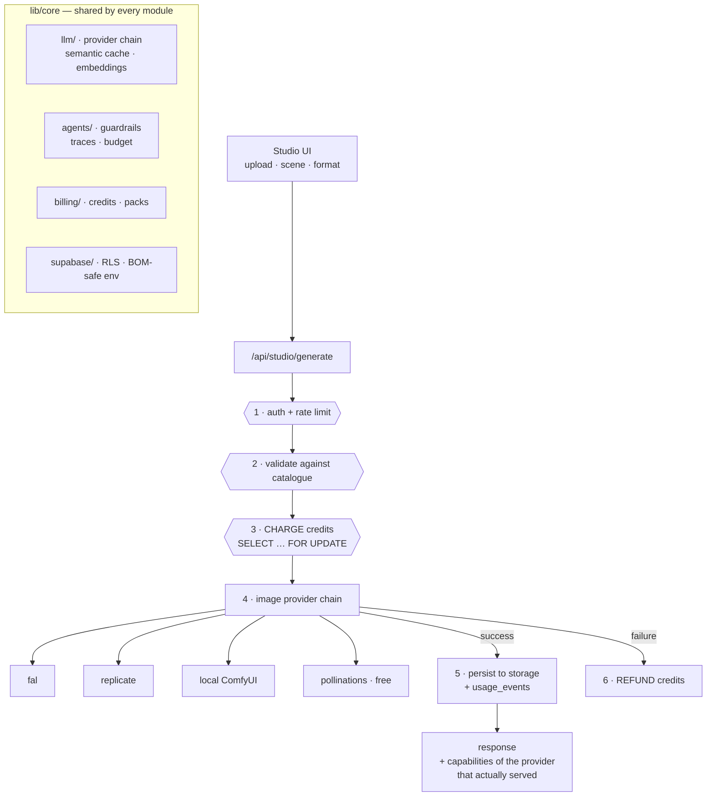

# OMNEX Factory

**One platform, many AI business modules — sharing one login, one credit balance
and one AI infrastructure.**

A module is a route group plus a manifest entry. The dashboard, pricing and
navigation are generated from that manifest, so shipping a new product is
configuration rather than a new application. Credits are the single currency
across every module, which is what makes each new module raise the value of a
purchase already made.

Module #1 is **AI Ad Studio**: upload a product photo, pick a scene, get
campaign-grade visuals across every publishing format.

---

## Why this exists

Most agent demos work once, on a good day, on the happy path. This is built
around the opposite question: **what does an agent system do when it is wrong,
and how would you know?**

That question shaped nearly every design decision below.

---

## Architecture



### The order in step 3–6 is the point

Credits are charged **before** the provider call, because the balance row is
locked and decremented inside a single SQL function — that is what stops two
simultaneous requests spending the same credits. And because charging first
would otherwise bill for nothing, a provider failure **refunds**.

---

## Design decisions worth reading

**The provider chain reports who actually served.**
A response used to advertise the capabilities of the *intended* provider while a
fallback had really produced the render — so a control that the serving provider
ignores looked available. `capabilitiesOf(result.provider)` reports on what ran.

**A control that does nothing is not shipped.**
One provider silently ignores its `strength` parameter — proven by identical
SHA-256 output at two different settings. Since a generative model returns
different images anyway, determinism had to be established first before a
difference could mean anything. Providers now declare `honoursStrength`, and the
UI hides the fidelity control when it would be fake.

**Guardrails run on output, not just input.**
Prompt-injection detection on fetched content, and outbound checks for leaked
credentials, unfilled template placeholders, and messages addressed to one named
recipient being published to everyone. That last rule exists because it happened.

**Budgets stop runs with a reason.**
Three independent ceilings — passes, tokens, wall-clock — because they fail
differently: a pass cap catches a loop that thrashes without spending, a token
cap catches one runaway generation, a wall-clock cap catches a hung provider.
The default sits below the platform timeout so a run stops with a stated cause
instead of being killed without one.

**Traces preserve the shape of a run.**
A span tree with parent links, a `failurePath()` that returns only the failing
branch, and totals computed from spans rather than tallied as the run proceeds.

**Tests run against a real database.**
`consume_credits` is PL/pgSQL whose correctness *is* the row lock, so a mock
would prove nothing. CI starts a real Postgres in a container and asserts under
concurrency: ten simultaneous spends of 20 against a balance of 100 leave exactly
five successes and a balance of zero.

---

## Stack

| Layer | Choice |
|---|---|
| App | Next.js 16 (App Router), React 19, TypeScript strict + `exactOptionalPropertyTypes` |
| Data | Supabase / Postgres, RLS, PL/pgSQL, pgvector |
| Payments | Stripe — one-time credit packs, webhook idempotency by primary-key conflict |
| Images | Provider chain: fal · replicate · local ComfyUI · pollinations (free fallback) |
| LLM | Free-first chain: Ollama · Groq · Google · OpenRouter · HF · Anthropic |
| CI | GitHub Actions — types, unit tests, real Postgres via Testcontainers, prod build |

---

## Layout

```
app/(app)/studio/          module #1 — AI Ad Studio
app/api/studio/            generate · upload
app/api/stripe/            checkout · webhook · portal
lib/core/                  shared by every module
  ├─ llm/                  provider chain · semantic cache · embeddings
  ├─ images/               image provider chain · ComfyUI client
  ├─ agents/               guardrails · traces · budget
  ├─ billing/              credits · packs
  └─ supabase/             env (BOM-safe) · admin · server · client
lib/modules/
  ├─ registry.ts           module manifests — the factory spine
  └─ studio/               11 campaign categories · personas · prompt builder
supabase/migrations/       credit ledger · usage events · webhook idempotency
```

## Running it

```bash
npm install
cp .env.local.example .env.local   # Supabase URL + keys required
npm run dev
```

Tests, including the containerised database suite (needs Docker):

```bash
npm test
```

---

*Built and operated solo. Every behaviour described above is asserted by a test
or was verified against the live system — none of it is aspirational.*
